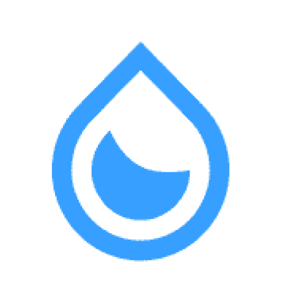

# 💧 Water Saver - Smart Water Management System

<div align="center">
  
  
  [](https://flutter.dev)
  [](https://firebase.google.com)
  [](https://dart.dev)
  
  **Intelligent Water Tank Management with IoT Integration**
</div>

## 🌟 Overview

Water Saver is a comprehensive Flutter application designed to revolutionize water management through smart IoT integration. The app provides real-time monitoring, automated control, and intelligent analytics for water tank systems, helping users optimize water usage and prevent overflow or dry-run situations.

## ✨ Key Features

### 🏠 **Smart Home Integration**
- **Real-time Monitoring**: Live water level tracking for both roof-top tanks and reservoirs
- **Automated Motor Control**: Intelligent motor operation based on customizable thresholds
- **IoT Device Integration**: Seamless ESP32 device connectivity via SmartConfig protocol

### 📊 **Advanced Analytics**
- **Interactive Dashboards**: Beautiful liquid progress indicators and visual tank representations
- **Historical Reports**: Comprehensive motor usage analytics and water consumption patterns
- **Trend Analysis**: Data-driven insights using FL Chart integration

### ⚙️ **Intelligent Controls**
- **Dual Operation Modes**: Manual and automatic motor control with safety protocols
- **Threshold Management**: Customizable water level thresholds for optimal performance
- **Calibration System**: Automated sensor calibration for accurate measurements

### 🔧 **Smart Configuration**
- **WiFi SmartConfig**: Easy ESP32 device onboarding and network configuration
- **User-Friendly Setup**: Guided onboarding experience with intuitive interfaces
- **Cross-Platform Support**: Native performance on Android and iOS

### 🔐 **Security & Authentication**
- **Firebase Authentication**: Secure user management with Google Sign-In integration
- **Encrypted Storage**: Local data protection using Flutter Secure Storage
- **Real-time Sync**: Cloud-based data synchronization and backup

## 🏗️ Architecture

### **Tech Stack**
- **Framework**: Flutter 3.27.3+ with Dart 3.6.1+
- **State Management**: Riverpod with code generation
- **Backend**: Firebase (Auth, Firestore, Realtime Database, Storage)
- **IoT Communication**: ESP SmartConfig protocol
- **Local Storage**: Flutter Secure Storage with encryption
- **UI/UX**: Responsive design with custom animations

### **Key Dependencies**
```yaml
# Core Framework
flutter_riverpod: ^2.6.1          # State management
go_router: ^16.0.0                # Navigation

# Firebase Integration
firebase_core: ^3.13.0            # Firebase core
firebase_auth: ^5.5.2             # Authentication
cloud_firestore: ^5.6.6           # NoSQL database
firebase_database: ^11.3.5        # Realtime database

# IoT & Connectivity
esp_smartconfig: ^3.0.0           # ESP32 device configuration
connectivity_plus: ^6.1.5         # Network connectivity
network_info_plus: ^6.1.4         # Network information

# UI Components
fl_chart: ^1.0.0                  # Data visualization
liquid_progress_indicator_v2: ^0.5.0  # Animated progress indicators
responsive_sizer: ^3.3.1          # Responsive design

# Utilities
freezed: ^3.1.0                   # Code generation
json_annotation: ^4.9.0           # JSON serialization
```

## 📱 Core Screens

### **🏠 Home Dashboard**
- Real-time water level visualization
- Motor status and control panel
- Quick insights and system alerts
- Tank volume and fill percentage

### **📊 Analytics & Reports**
- Historical motor usage graphs
- Water consumption trends
- System performance metrics
- Exportable data reports

### **⚙️ Adjustments & Settings**
- Tank threshold configuration
- Motor operation parameters
- Calibration management
- User preferences

### **📡 WiFi Configuration**
- ESP32 device discovery
- Network credential setup
- Device pairing wizard
- Connection diagnostics

### **👤 User Management**
- Personal profile settings
- Authentication management
- Data privacy controls
- Subscription management

## 🚀 Getting Started

### **Prerequisites**
- Flutter SDK 3.27.3 or higher
- Dart SDK 3.6.1 or higher
- Android Studio / VS Code with Flutter extensions
- Firebase project setup
- ESP32 device (for IoT functionality)

### **Installation**

1. **Clone the repository**
   ```bash
   git clone https://github.com/M4dhav/water-saver.git
   cd water-saver
   ```

2. **Install dependencies**
   ```bash
   flutter pub get
   ```

3. **Firebase Setup**
   - Create a new Firebase project
   - Add Android and iOS apps to your Firebase project
   - Download and place `google-services.json` (Android) and `GoogleService-Info.plist` (iOS)
   - Configure Firebase Authentication, Firestore, and Realtime Database

4. **Generate code**
   ```bash
   flutter packages pub run build_runner build
   ```

5. **Run the application**
   ```bash
   flutter run
   ```

## 🔧 Configuration

### **Firebase Setup**
1. Enable Authentication with Google Sign-In
2. Create Firestore collections:
   - `users` - User profiles
   - `userDataUpload` - Device sensor data
   - `userDataReceive` - Device configuration
3. Set up Firebase Realtime Database for live data sync

### **ESP32 Device Configuration**
- Flash compatible firmware supporting SmartConfig
- Configure sensor connections (ultrasonic/pressure sensors)
- Set up motor control relays
- Ensure proper WiFi connectivity

## 📊 Data Models

### **Water Level Data**
```dart
UserDataUpload {
  String acPowerFail,
  int motorOnDuration,
  List<int> rftLevelData,      // Roof-top tank levels
  List<int> rsvLevelData,      // Reservoir levels
  String motorOn,
  String motorOff,
  // ... additional sensor data
}
```

### **Configuration Data**
```dart
UserDataReceive {
  bool autoToggleConsent,
  String rftHeight,            // Tank height
  String rftThUpPercent,       // Upper threshold
  String rftThDnPercent,       // Lower threshold
  String rsvThDnPercent,       // Reservoir threshold
  // ... additional settings
}
```

## 🤝 Contributing

We welcome contributions! Please read our [Contributing Guidelines](CONTRIBUTING.md) before submitting pull requests.

### **Development Workflow**
1. Fork the repository
2. Create a feature branch
3. Make your changes
4. Add tests if applicable
5. Submit a pull request

## 📄 License

This project is licensed under the MIT License - see the [LICENSE](LICENSE) file for details.

## 🙏 Acknowledgments

- Flutter team for the amazing framework
- Firebase for backend infrastructure
- ESP32 community for IoT integration
- All contributors and beta testers

## 📞 Support

For support and questions:
- 📧 Email: support@watersaver.app
- 🐛 Issues: [GitHub Issues](https://github.com/M4dhav/water-saver/issues)
- 📖 Wiki: [Project Wiki](https://github.com/M4dhav/water-saver/wiki)

---

<div align="center">
  <strong>Made with ❤️ for smarter water management</strong>
  <br>
  <sub>Help us save water, one drop at a time! 💧</sub>
</div>
